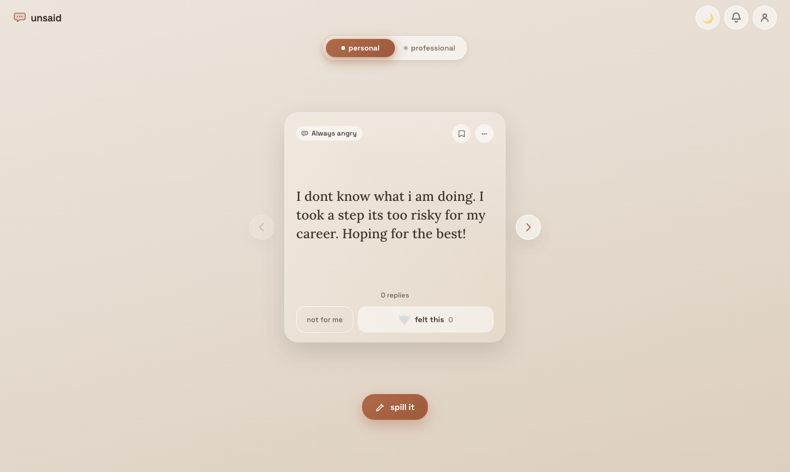
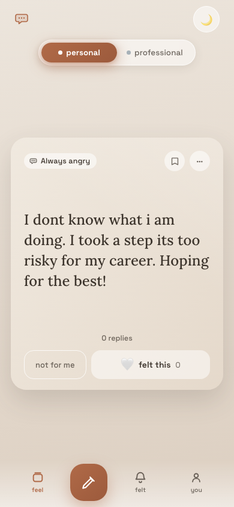

# unsaid

> say the thing you've never said. nobody knows it's you. everybody feels it.

**Live: [unsaidnow.vercel.app](https://unsaidnow.vercel.app)**

<p align="center">
  
  
</p>

An anonymous confessions app with two worlds, personal and professional. Swipe feed, empathy-first reactions, comments, moderation, and a PWA install flow.

Designed and built solo in three weeks. Figma for the design system, Claude Code for the build.

## How design maps to code

The design system lives in code, not just in Figma.

- `packages/tokens` holds every world, mood, topic, and gradient as typed TypeScript. Same names as the Figma variables.
- `apps/web/src/lib/theme.ts` turns those tokens into CSS custom properties, with light and dark pairs resolved per scope.
- Components use the variables (`--accent`, `--sp-2`, `--r-card`), never hardcoded values. Change a token once and every screen updates.
- `apps/web/src/lib/useDialogA11y.ts` handles focus trapping, Escape, and focus return for every overlay. `prefersReducedMotion` guards every animation. Tap targets are a token (`--tap-min: 44px`).

Open `ConfessionCard.tsx` next to the Figma component and the props match the variants.

## Built with

Next.js 15, React 18, TypeScript, CSS Modules, Supabase (Postgres, RLS, edge functions), Expo (iOS app, built but not yet published), Vercel.

## Status

Web app is live. iOS app in `apps/mobile` is complete and waiting on an Apple Developer account.

## Repo layout

```
apps/mobile      Expo iOS app (expo-router, Reanimated swipe feed)
apps/web         Next.js — public feed, share pages (/p/[id]), /admin moderation
packages/tokens  design tokens (worlds, moods, gradients) + shared types
packages/api     typed Supabase access layer used by both apps
supabase/        migrations, RLS, views, edge functions, seed data
docs/            privacy policy, moderation policy, App Review notes
```

## Running your own instance — everything below is free

1. **Supabase** — create a project at supabase.com → grab `Project URL`, `anon key`, `service_role key`. This unblocks the live deploy. In the dashboard, enable **Authentication → Sign in / up → Anonymous sign-ins** (the primary way in — no email needed; abuse is covered by the new-account rate limits + captcha option).
2. **OpenAI API key** — platform.openai.com (the moderation endpoint we use is free).
3. **Vercel** — account for web deploys (free tier; gives a `*.vercel.app` URL until there's a domain).
4. Optional but recommended: **PostHog** (analytics) + **Sentry** (crashes) accounts.
5. Later: Apple Developer Program ($99/yr) to ship `apps/mobile` to the App Store — it's already built.

## Local development

```bash
pnpm install

# backend (requires Docker + supabase CLI: brew install supabase/tap/supabase)
supabase start            # local Postgres + auth + functions
supabase db reset         # applies migrations + seed (24 seeded confessions)
supabase functions serve  # edge functions with --env-file supabase/.env

# web
cp apps/web/.env.example apps/web/.env.local   # fill in supabase URL/keys
pnpm web

# mobile (iOS simulator)
cp apps/mobile/.env.example apps/mobile/.env   # fill in supabase URL/key
pnpm mobile
```

Secrets needed by edge functions (set via `supabase secrets set` in prod, `supabase/.env` locally): `OPENAI_API_KEY`. (`SUPABASE_URL` / `SUPABASE_SERVICE_ROLE_KEY` are injected automatically.)

## The anonymity invariant

`author_id` never leaves the server. Clients read posts/comments only through the
`feed_posts` / `post_comments` views (no author column), and all writes go through
edge functions so moderation and rate limits cannot be bypassed. If you add a query
or view, preserve this — it is the product.

## Safety architecture (do not "simplify" these away)

No dislike button, no DMs, no images, no public profiles, 500-char cap,
per-post replies-off switch, pre-publish moderation (rules + OpenAI), crisis
interstitial with helplines (never pure auto-block for expression), report →
auto-hide at 3 reports → human queue at `/admin`, mute-author without exposing
identity, real account deletion (incl. Apple token revocation).
